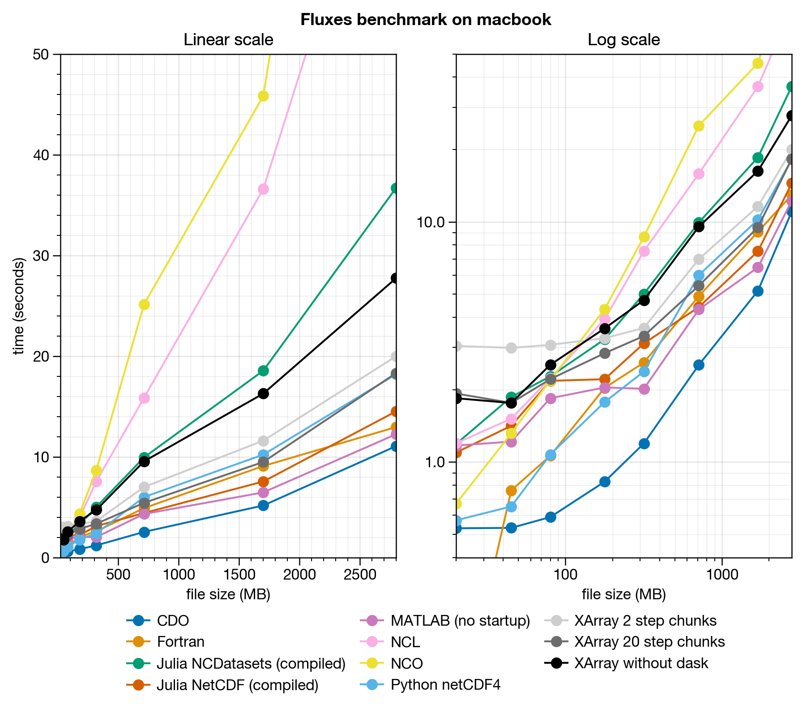
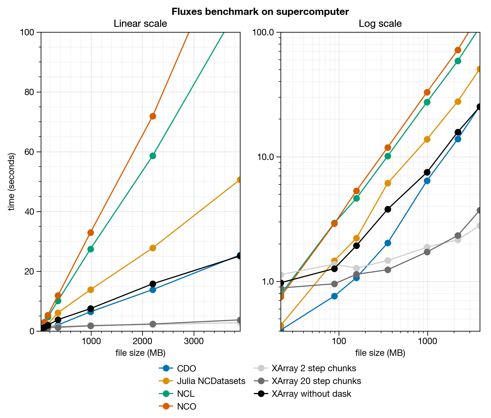
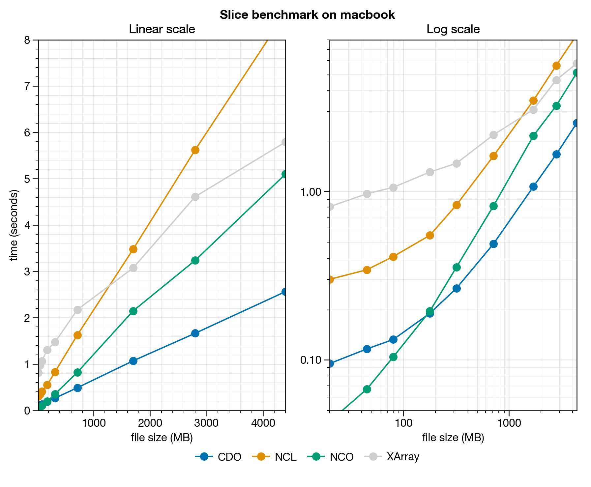
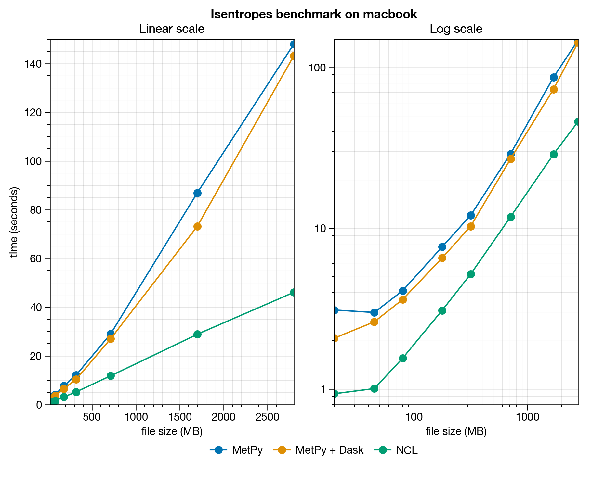

<!--
Installation
------------

It was *exceedingly* difficult to get CDO compiled with threadsafe HDF5 like is the default case for Anaconda-downloaded versions on Linux. I used [this thread](https://code.mpimet.mpg.de/boards/2/topics/4630?r=5714#message-5714) for instructions. This required manually compiling HDF5 with custom `./configure` flags and custom prefix, then linking with homebrew using `brew link hdf5`.

I got frequent errors following user instructions, which disappeared by disabling `--with-pthread=/usr/local --enable-unsupported`. See discussion [here](http://hdf-forum.184993.n3.nabble.com/HDF5-parallel-and-threadsafe-td1701166.html) and Github reference to that discussion [here](https://github.com/conda-forge/hdf5-feedstock/pull/57). I tried manually compiling the netcdf library but this seemed to make no difference -- the *provided* netcdf Homebrew library was the same.

In the end *could never* get the CDO to do NetCDF4 I/O parallelization without at least sporadic errors. However looks like *performance with thread locking is often faster anyway*.
-->

# Introduction
This repo provides benchmarks for common 
data analysis tasks in atmospheric science
accomplished with several different tools:

* Fortran
* Climate Data Operators (CDO)
* NCAR Command Language (NCL)
* NetCDF Operators (NCO)
* Julia
* Python
* MATLAB

For an in-depth description and comparison of these tools,
see [BACKGROUND.md](BACKGROUND.md).
<!-- languages. -->
<!-- some general notes. -->

# Usage
## Generating sample data
To run benchmarks, you must first generate sample data. This is done with the `DataGenerator.py` script. It generates NetCDF files of arbitrary resolution containing artificial temperature, zonal wind, and meridional wind data. It requires `xarray` and `dask`.

Usage:
```
./DataGenerator.py RESO [-h|--help] [-l|--lev=NLEV] [-t|--time=NTIME] [-d|--dir=DIR]
```
For the below results, data was generated as follows:
```
for reso in 20 10 7.5 5 3 2 1.5; do ./DataGenerator.py --reso=$reso; done
```

## Running benchmarks
To run your own benchmarks, use the shell scripts in the top-level directory.

Example usage:
```
./TestName.sh [DIR]
```
`DIR` is the directory containing the sample NetCDF files.

To make your own `TestName.sh` benchmark, start by copying an existing benchmark and work from there. Each `TestName.sh` benchmark does the following:

1. Source the helper script `header.sh`. This script declares some bash functions and `cd`s into the `testname` directory, where the language-specific test scripts must be stored.
2. Iterate through the NetCDF files in `DIR`.
  * Call the `init` bash function at the top of the loop.
  * Call the `benchmark` function for each test script in the `testname` directory, with the command-line call signature as the argument. For example: to run `python test.py file.nc`, we use `benchmark python test.py file.nc`. If the benchmark requires saving data, it should be saved into the `out` folder inside the `testname` directory.

Note that `header.sh` also creates a special `python` function that lets you name your python files the same name as existing python packages. For example: `xarray.py` is a valid file name.

## Interpreting results
Results for each file are saved to markdown-style tables in the `results` directory. To generate plots of these tables (see below for an example), use the `plots.ipynb` IPython notebook. This requires the [numpy](https://numpydoc.readthedocs.io/en/latest/) and [ProPlot](https://proplot.readthedocs.io/en/latest) packages. ProPlot is a matplotlib wrapper I developed.

# Benchmarks
## Fluxes.sh
For this benchmark, eddy fluxes of heat and momentum were calculated and saved into new NetCDF files.

Climate Data Operators (CDO) is the clear winner here, followed closely by MATLAB, Fortran, and python in the same pack, depending on the file size.
For files smaller than 100MB though, the differences are never that large, and
the NCAR Command Language (NCL) and NetCDF Operators (NCO) appear to be acceptable choices.

The benchmark was run on my macbook (first plot), and on the
Cheyenne HPC compute cluster interactive node (second plot),
which is a shared resource consisting of approximately 72 cores.




<!-- # Hybrid-to-pressure interpolation benchmarks
   - I have yet to formalize this benchmark, but performed some tests for my research.
   - I used 400-timestep T42L40 resolution files from a dry dynamical core model.
   -
   - * NCL interpolation: **70s total**
   - * CDO interpolation: **216s total**
   -   - **30s pre-processing** (probably due to inefficiency of overwriting original ncfile with file that deletes coordinates)
   -   - **94s for setting things up** (because we have to write surface geopotential to same massive file, instead of declaring as separate variable in NCL)
   -   - **122s actual interpolation** (with lots of warnings)
   -
   - This was a surprising result! And it supports my hypothesis that CDO is great
   - for simple data analysis tasks, but unsuited for complex tasks.
   - [> Alternative explanation is that, <]
   - Perhaps formal, language-based tools like python and NCl
   - are more appropriate for parallel computation because the data is loaded into memory once,
   - then the calculations can proceed quickly. Another issue could have been the necessary
   - disk reads (5) for the CDO script, compared to just 1 NCL disk read. -->

## Slices.sh
For this benchmark, the first quarter of timesteps
were selected and saved into a new NetCDF file.

The results here were particularly interesting -- NCO
is the winner for small files, but CDO beats it for
large files, at which point the time required
for overhead operations
is negligible. XArray is the slowest across all file sizes.
<!-- This was a simple test comparing the performance
   - of various tools for selecting the first one quarter
   - timesteps and saving the result  -->
<!-- slicing data across the longitude dimensions, compared
   - between xarray and NCO. This test is a work-in-progress. -->



## EmpiricalOrthogonalFunctions.sh
Coming soon!

## SpectralDecomposition.sh
Coming soon!

## Model2Isobars.sh
Coming soon!

## Isobars2Isentropes.sh
There are only two obvious tools for interpolating between isobars and isentropes: NCL, and python using the MetPy package. This benchmark compares them.

This time, NCL was the clear winner! The MetPy script was also raising
a bunch of strange errors when it ran. Evidently, the kinks in the MetPy
algorithm haven't been ironed out yet.



