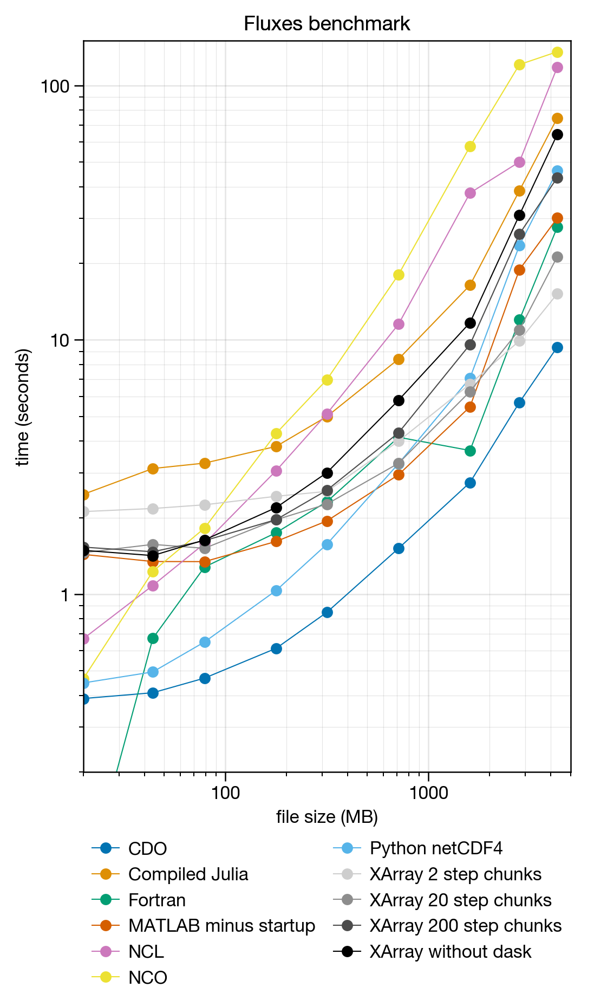
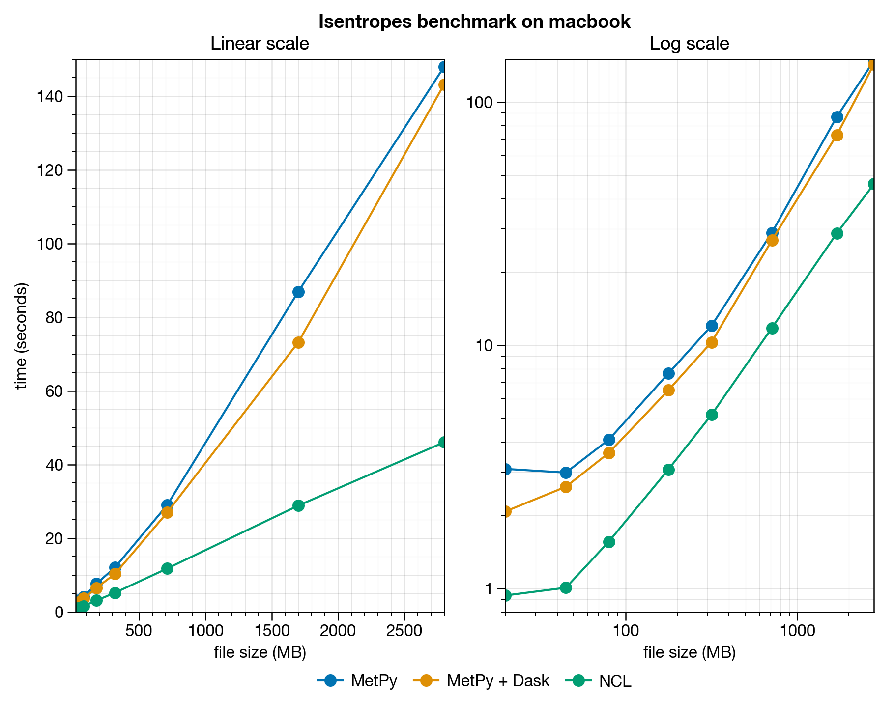
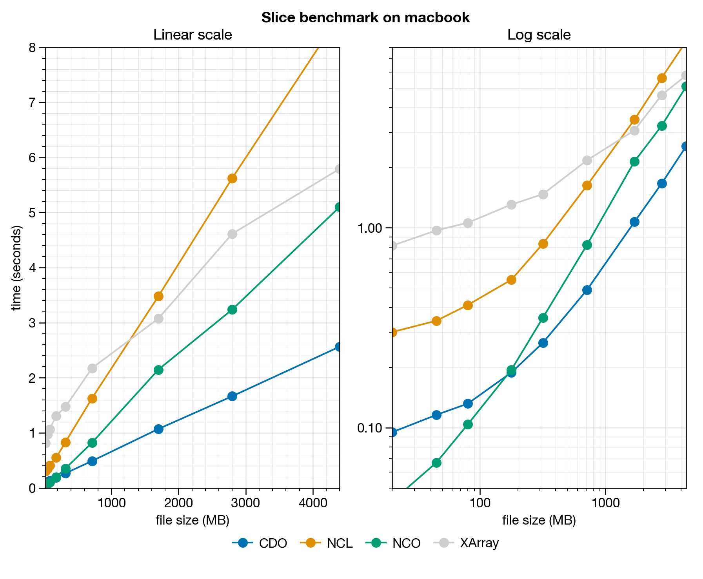

<!--
Installation
------------

It was *exceedingly* difficult to get CDO compiled with threadsafe HDF5 like is the default case for Anaconda-downloaded versions on Linux. I used [this thread](https://code.mpimet.mpg.de/boards/2/topics/4630?r=5714#message-5714) for instructions. This required manually compiling HDF5 with custom `./configure` flags and custom prefix, then linking with homebrew using `brew link hdf5`.

I got frequent errors following user instructions, which disappeared by disabling `--with-pthread=/usr/local --enable-unsupported`. See discussion [here](http://hdf-forum.184993.n3.nabble.com/HDF5-parallel-and-threadsafe-td1701166.html) and Github reference to that discussion [here](https://github.com/conda-forge/hdf5-feedstock/pull/57). I tried manually compiling the netcdf library but this seemed to make no difference -- the *provided* netcdf Homebrew library was the same.

In the end *could never* get the CDO to do NetCDF4 I/O parallelization without at least sporadic errors. However looks like *performance with thread locking is often faster anyway*.
-->

# Atmospheric science data analysis benchmarks
This repo provides benchmarks for common 
data analysis tasks in atmospheric science
accomplished with several different tools:

* Fortran
* Climate Data Operators (CDO)
* NCAR Command Language (NCL)
* NetCDF Operators (NCO)
* Julia
* Python
* MATLAB

This repo is a work-in-progress. Below are some notes,
an overview of the languages and tools tested, and some (possibly
contentious) opinions on how the languages compare.
<!-- languages. -->
<!-- some general notes. -->

## NetCDF versions
All benchmarks described here
involve reading and writing to the NetCDF file format, used for storage of multi-dimensional
scientific datasets. There are two major versions of this file
format: version 3 and version 4.
I observed two notable performance differences when
sample data was saved to version 3 of the NetCDF format instead of version 4:
<!-- the NetCDF3 and NetCDF4 versions of the sample data: -->

* With NetCDF3 files, CDO responds **less favorably** to thread-safe disk IO locking (the `-L` flag). It tended to speed things up for smaller datasets (over-optimization?) then slow things down for larger datasets, but **more-so** for NetCDF3 files.
* For NetCDF3 files, non-dask XArray datasets (i.e. datasets loaded with `chunks=None`) performed somewhat **worse** compared to datasets loaded from NetCDF4 files, and the effect was more pronounced for large datasets. However with Dask chunking, the NetCDF4 speed improvements were marginal -- even approaching 2GB file sizes (**7s** vs **9s** for the fluxes benchmark).

Since most large general circulation models still produce the older-format NetCDF3
files, only results for these datasets are shown.
But anyway, the differences weren't that huge.

## Fortran
Fortran is the only low-level, high-performance language tested in these benchmarks. It may
seem like an anachronism to outsiders, but there are [perfectly valid](http://moreisdifferent.com/2015/07/16/why-physicsts-still-use-fortran/) reasons scientists still prefer it. The most important of these is that a very powerful parallelization tool, MPI, can be used only with C++ and Fortran. And of these two, although it is certainly not the right tool
for software engineers and object-oriented programming,
Fortran is the more array-friendly and easier-to-learn language (its name, after all, is an acronym for Formula Translator). Also, it is generally just as fast as C++. Fortran 
is used for high-performance numerical algorithms and geophysical models.
<!-- -- for example, -->
<!-- models used to predict the weather -->
<!-- on a day-to-day basis and help us understand future climate change hazards. -->
<!-- the Coupled Model Intercomparison Project. -->
<!-- communicated by the Intergovernmental Panel on Climate Change (IPCC). -->

## NetCDF Operators (NCO)
The NetCDF operators are a group of command-line tools developed by Unidata for
working with NetCDF files, released alongside the original file format.
Since it was released by the creators,
one might think it would be the efficient tool for manipulating
NetCDF data. But it turns out most other, secondary tools are generally
more efficient.
<!-- , since it was released by the creators. -->

For the NCO benchmarks, the most-used tool was `ncap2`. Though a variety of other tools
are available for various analysis tasks,
like `ncks` (NetCDF kitchen sink), `ncbo` (NetCDF binary operator),
`ncwa` (NetCDF weighted averager),
`ncrcat` (NetCDF record concatenator), `ncecat` (NetCDF ensemble concatenator), `ncra` (NetCDF record averager), `nces` (NetCDF ensemble statistics), `ncremap` (NetCDF remaper), `ncflint` (NetCDF file interpolator), and `ncclimo` (NetCDF climatology generator). 
The documentation can be found [here](http://nco.sourceforge.net/).

## Climate Data Operators (CDO)
CDO has generally similar functionality to the NetCDF operators
and places strict requirements on the dataset format (e.g. all variables must have 2 horizontal "spatial" dimensions, an optional height dimension, and an optional time dimension). Although I'm sure these restrictions are necessary, they can sometimes be frustrating -- and anyway, CDO may, at first glance, seem redundant. 
But it offers **enormous** speed
improvements over NCO, is more flexible, and is generally easier and more intuitive to use. "Operator chaining" is the most notable improvement over NCO. The documentation can be found [here](https://code.mpimet.mpg.de/projects/cdo/wiki/Cdo#Documentation).

The newest versions of `cdo` have zonal-statistics functions available
to the `expr` subcommand. These functions
are used in `fluxes.cdo`, but
the equivalent calculation in older versions of `cdo`
requires an ugly workaround with lots of operator chaining (see
`misc/fluxes_ineff.cdo`). It turned out this
workaround was **much** slower than calculating fluxes with
`expr`. This matches my experience in general: CDO is great for
**simple** tasks, but for **complex**, highly chained commands, it can quickly grow
less efficient than much older, but more powerful and expressive, tools.
<!-- With an older, verbose CDO algorithm for getting fluxes (see `trash/fluxes_ineff.cdo`), CDO was **much much slower**, and the problem was exacerbated by adding levels. -->

## NCAR Command Language (NCL)
NCAR command language is a favorite among many atmospheric scientists, myself included.
It is certainly not the fastest language -- in fact, it is usually the slowest after the
native NetCDF operators -- but it is relatively easy-to-use, concise, and provides specialized tools for atmospheric scientists. Just like everything in MATLAB is
an array, and everything in Python is an "object", everything in NCL is a
dataset with named dimensions. But with the recent [end-of-life announcement](https://www.ncl.ucar.edu/Document/Pivot_to_Python/NCL_Pivot_to_Python_Report_and_Roadmap.pdf), it
may be advisable to move away from NCL over the coming years. The NCL documentation can
be found [here](https://www.ncl.ucar.edu/Document/).

Note that using the NCL feature `setfileoption("nc", "Format", "LargeFile")` made **neglibile** difference in final wall-clock time. Also note there are no options to improve large file processing, and the official recommendation is to split files up by level or time. See [this NCL talk post](https://www.ncl.ucar.edu/Support/talk_archives/2011/2636.html) and [this stackoverflow post](https://stackoverflow.com/questions/44474507/read-large-netcdf-data-by-ncl).

## MATLAB
MATLAB (MATrix LABoratory) is a tried-and-tested, proprietary, high-level data
science language -- the language of choice for engineers and scientists over
the last few decades. But with the emergence of the free, open-source
programming language "Python" as a scientific computing
workhorse, scientists have been slowly making the switch.
And with the **massive** amount of collaborative work
put into scientific computing Python
packages, Python has become (for the most part) a superset
of MATLAB, and seems to have
overtaken MATLAB in terms of
performance and speed.
<!-- resource, and the massive amount of  -->

I have access to MATLAB 2014a through a license from my university.
Note that even without the Java Virtual Manager (`-nojvm`)
and without the display (`-nodisplay`), MATLAB scripts run from the command line
are delayed by up to several seconds!
On my machine, it takes about 9 seconds to start MATLAB
every time a MATLAB script is run from the command line.
Thus running a series of MATLAB commands
on small files for small tasks becomes quickly impractical.
To give MATLAB the best chance, the times shown in the benchmarks below omit
the startup time.

## Python
Python is the high-level, expressive, programming language that is
quickly becoming the favorite of academics and data scientists everywhere.
Almost all scientific computing Python tools are based around the 
array manipulation package ["numpy"](http://www.numpy.org/).
There are two of these tools (at least two well-known ones) for reading NetCDF files:
[netCDF4](http://unidata.github.io/netcdf4-python/netCDF4/index.html) (which confusingly,
also works with version 3 of the file format), and [XArray](http://xarray.pydata.org/en/stable/). The former is rather low-level and fast, the latter is high-level, powerful,
and very flexible. XArray is also closely integrated with [Dask](https://dask.org/),
which supports extremely high-performance array computations with
hidden parallelization and super fancy algorithms designed by some super smart people.
Dask is truly a game-changer, and with the proper "[chunking](http://xarray.pydata.org/en/stable/dask.html)" it can result in code as fast as compiled, serially executed
Fortran code.
<!-- parallel multi-dimensional array computations. -->

## Julia
Julia is the new kid on the block, and tries to combine the best-of-both worlds from MATLAB (e.g. the everything-is-an-array syntax) and Python.
The Julia workflow is quite different -- you **cannot** simply make repeated calls to some script on the command line, because this means the JIT compilation kicks in every time, and becomes a huge bottleneck. Instead you have two options:

1. Run things from a persistent notebook or REPL, making **repeated calls** to some function so that the JIT compilation can speed things up. For example, a simple julia script that iterates over 1000 NetCDF files and performs the same operation on them.
2. Compile to machine executable with [`PackageCompiler`](https://github.com/JuliaLang/PackageCompiler.jl) and a "snoop" script, which lets you call a binary executable. This is perhaps how numerical models written in Julia can be used. Since it is faster, unless stated otherwise, this is the approach used for benchmarks.
<!-- To give Julia the best shot -->
<!-- , each benchmark provides two times: -->
<!-- 1. Time from running a Julia script in an **interactive shell**, after running it with a test file so the JIT compilation has already kicked in. Obviously this was tedious to do systematically, with multiple files and multiple benchmarks, but I thought it was necessary. -->
<!-- 2. Time from running "pre-compiled" Julia code with the [`PackageCompiler`](https://github.com/JuliaLang/PackageCompiler.jl) utility. This has two drawbacks, being that pre-compiling Julia code is quite slow even for very simple programs, and the resulting machine code takes up massive amounts of space relative to the complexity of the program (since all dependencies must be compiled to machine code too). But, it does result in slightly faster code. -->

Julia is advertised for its raw speed in numerical computations.
But for simple data analysis tasks, and especially when working with large arrays,
Julia seems to perform no better than MATLAB or python. With the `NetCDF.jl` package (which mimics MATLAB's NetCDF utilities), Julia is somewhat slower than MATLAB. With the `NCDatasets.jl` package (which mimics the python xarray package), Julia is somewhat slower than python.
For me, there doesn't seem to be a compelling reason to switch from either of these tools to Julia yet. Perhaps as these packages are updated and I/O performance is improved,
there will be one day.
<!-- Perhaps it will fully replace MATLAB one day, but -->
<!-- evidently there is a lot of work to do. -->

# Generating sample data
The sample data was generated using
```
for reso in 20 10 7.5 5 3 2 1.5; do ./DataGenerator 60lev $reso; done
```
where the numbers refer to the latitude/longitude grid spacing.

# Eddy flux benchmark
For this benchmark, we use an assortment of languages to
calculate and save eddy fluxes of heat and momentum to new NetCDF files.

Climate Data Operators (CDO) are the clear winner here, followed closely by MATLAB, Fortran, and python in the same pack, depending on the file size.
For files smaller than 100MB though, the differences are never that large, and
the NCAR Command Language (NCL) and NetCDF Operators (NCO) appear to be acceptable choices.

The benchmark was run on my macbook (first plot), and on the
Cheyenne HPC compute cluster interactive node (second plot),
which is a shared resource consisting of approximately 72 cores.




<!-- # Hybrid-to-pressure interpolation benchmarks
   - I have yet to formalize this benchmark, but performed some tests for my research.
   - I used 400-timestep T42L40 resolution files from a dry dynamical core model.
   -
   - * NCL interpolation: **70s total**
   - * CDO interpolation: **216s total**
   -   - **30s pre-processing** (probably due to inefficiency of overwriting original ncfile with file that deletes coordinates)
   -   - **94s for setting things up** (because we have to write surface geopotential to same massive file, instead of declaring as separate variable in NCL)
   -   - **122s actual interpolation** (with lots of warnings)
   -
   - This was a surprising result! And it supports my hypothesis that CDO is great
   - for simple data analysis tasks, but unsuited for complex tasks.
   - [> Alternative explanation is that, <]
   - Perhaps formal, language-based tools like python and NCl
   - are more appropriate for parallel computation because the data is loaded into memory once,
   - then the calculations can proceed quickly. Another issue could have been the necessary
   - disk reads (5) for the CDO script, compared to just 1 NCL disk read. -->

# Interpolating from pressure levels to isentropes
There are only two obvious tools for interpolating between isobars and isentropes: NCL, and python using the MetPy package.
This benchmark compares them.

This time, NCL was the clear winner! The MetPy script was also raising
a bunch of strange errors when it ran. Evidently, the kinks in the MetPy
algorithm haven't been ironed out yet.

The benchmark was run on my macbook.



# Slicing latitudes
This was a simple test of slicing data across the longitude dimensions, compared
between xarray and NCO. This test is a work-in-progress.

The benchmark was run on my macbook.


